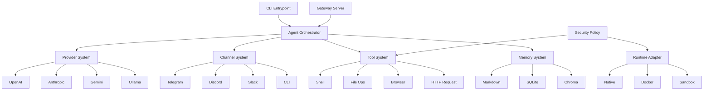
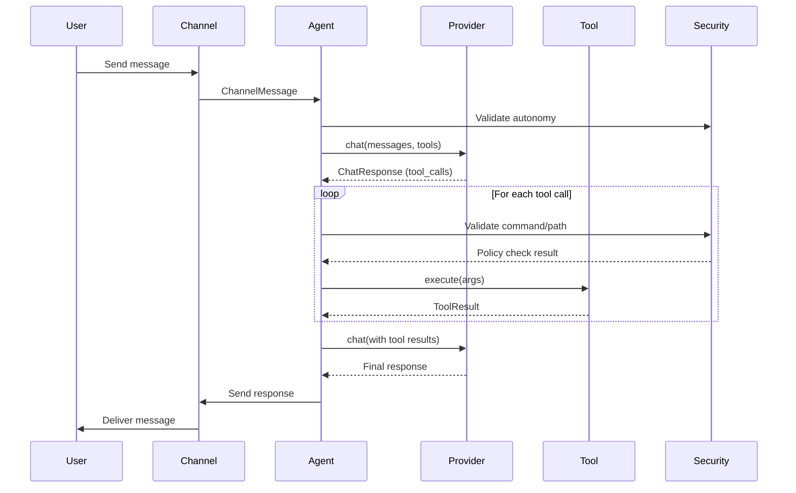
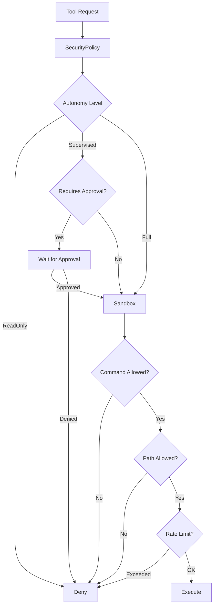

# System Architecture

ZeroClaw is a Rust-first autonomous agent runtime built on a trait-driven, modular architecture designed for high performance, security, and extensibility.

## Design Principles

The architecture is guided by these core principles:

- **Trait + Factory Pattern**: Extension points are intentionally explicit and swappable
- **Security-First**: Defaults lean secure-by-default with pairing, bind safety, limits, and secret handling
- **Performance Goals**: Binary size and execution speed are product goals, not nice-to-haves
- **Config as API**: Schema and CLI commands are effectively public interfaces
- **Deterministic Behavior**: Reliable CI and reproducibility are mandatory

## High-Level Component View



## Module Structure

The codebase follows a clear module hierarchy:

```
src/
├── main.rs              # CLI entrypoint and command routing
├── lib.rs               # Module exports and shared command enums
├── config/              # Schema + config loading/merging
├── agent/               # Orchestration loop
├── gateway/             # Webhook/gateway server
├── security/            # Policy, pairing, secret store
│   ├── policy.rs        # SecurityPolicy and AutonomyLevel
│   ├── pairing.rs       # Device pairing for channels
│   ├── secrets.rs       # Encrypted credential storage
│   └── traits.rs        # Sandbox trait
├── memory/              # Persistence backends
│   └── traits.rs        # Memory trait
├── providers/           # Model providers
│   ├── traits.rs        # Provider trait
│   ├── openai.rs
│   ├── anthropic.rs
│   └── ...
├── channels/            # Messaging platforms
│   ├── traits.rs        # Channel trait
│   ├── telegram.rs
│   ├── discord.rs
│   └── ...
├── tools/               # Agent capabilities
│   ├── traits.rs        # Tool trait
│   ├── shell.rs
│   ├── file_read.rs
│   └── ...
├── peripherals/         # Hardware peripherals (STM32, RPi GPIO)
│   └── traits.rs        # Peripheral trait
├── runtime/             # Runtime adapters
│   └── traits.rs        # RuntimeAdapter trait
└── observability/       # Telemetry and tracing
    └── traits.rs        # Observer trait
```

## Agent Orchestration Loop

The agent loop (`src/agent/loop_.rs`) coordinates the execution cycle:

1. **Message Reception**: Channel delivers user message
2. **Context Assembly**: Load conversation history and system prompt
3. **Provider Invocation**: LLM generates response with optional tool calls
4. **Tool Execution**: Validate and execute requested tools
5. **Security Gates**: Apply policy checks at each boundary
6. **Memory Storage**: Persist important facts and decisions
7. **Response Delivery**: Send result back through channel



## Extension Points

The architecture defines explicit extension points through traits:

| Extension Point | Trait | Description |
|----------------|-------|-------------|
| Model Inference | `Provider` | Add new LLM backends (OpenAI, Anthropic, local models) |
| Messaging | `Channel` | Add new communication platforms (Telegram, Discord, Slack) |
| Capabilities | `Tool` | Add new agent capabilities (shell, files, HTTP, browser) |
| Persistence | `Memory` | Add new memory backends (markdown, SQLite, vector DBs) |
| Isolation | `Sandbox` | Add new sandboxing backends (Docker, Firejail, Landlock) |
| Hardware | `Peripheral` | Add new hardware boards (STM32, RPi GPIO, sensors) |
| Execution | `RuntimeAdapter` | Add new runtime environments (native, containers) |
| Telemetry | `Observer` | Add new observability backends (logging, metrics) |

## Security Architecture

Security is layered and defense-in-depth:



Key security components:

- **AutonomyLevel**: Controls agent action permissions (ReadOnly, Supervised, Full)
- **SecurityPolicy**: Enforces command allowlists, path validation, rate limiting
- **PairingGuard**: Device authentication for channel access
- **SecretStore**: Encrypted credential storage with age encryption
- **Sandbox**: OS-level isolation (Docker, Firejail, Bubblewrap, Landlock)

See [Security Architecture](./security.mdx) for detailed information.

## Configuration System

Configuration is loaded from:

1. `zeroclaw.toml` (workspace config)
2. `~/.config/zeroclaw/config.toml` (user config)
3. Environment variables (overrides)
4. CLI flags (highest priority)

The schema is defined in `src/config/schema.rs` and treated as a public API contract.

## Performance Characteristics

- **Binary Size**: Optimized for minimal size (release profile, careful dependencies)
- **Startup Time**: Sub-second cold start for CLI commands
- **Memory Usage**: Efficient async runtime with bounded concurrency
- **Throughput**: Concurrent message processing across channels

## Observability

The observability subsystem provides:

- **Structured Logging**: `tracing` crate with configurable levels
- **Audit Trail**: Security-relevant events logged to `AuditLogger`
- **Runtime Traces**: Performance and execution flow tracking
- **Health Checks**: Provider, channel, and memory health status

## Next Steps

- [Trait System](./trait-system.mdx) - Deep dive into trait-driven design
- [Providers](./providers.mdx) - Provider system and factory pattern
- [Channels](./channels.mdx) - Channel system and message routing
- [Tools](./tools.mdx) - Tool system and security validation
- [Memory](./memory.mdx) - Memory backends and persistence
- [Security](./security.mdx) - Security architecture and policy enforcement
