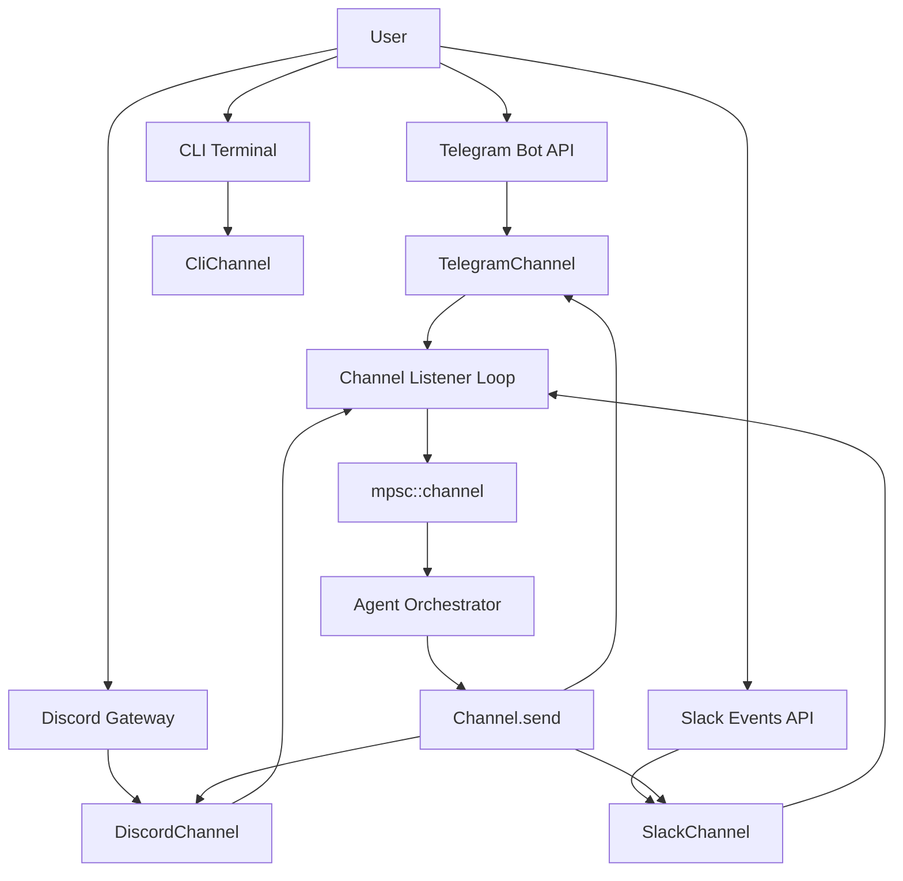
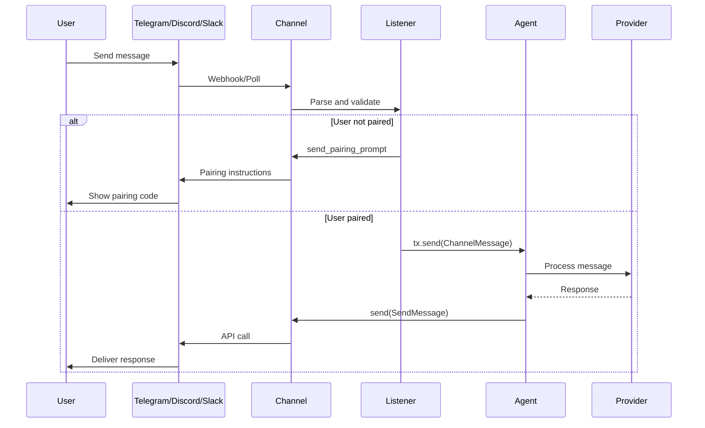

# Channel System

The Channel system provides a uniform interface for integrating messaging platforms (Telegram, Discord, Slack, etc.), enabling ZeroClaw to communicate seamlessly across different channels.

## Architecture Overview



## Channel Trait

All channels implement the `Channel` trait from `src/channels/traits.rs`:

```rust
#[async_trait]
pub trait Channel: Send + Sync {
    /// Human-readable channel name
    fn name(&self) -> &str;

    /// Send a message through this channel
    async fn send(&self, message: &SendMessage) -> anyhow::Result<()>;

    /// Start listening for incoming messages (long-running)
    async fn listen(&self, tx: tokio::sync::mpsc::Sender<ChannelMessage>) -> anyhow::Result<()>;

    /// Check if channel is healthy
    async fn health_check(&self) -> bool {
        true
    }

    /// Signal that the bot is processing a response (typing indicator)
    async fn start_typing(&self, _recipient: &str) -> anyhow::Result<()> {
        Ok(())
    }

    /// Stop any active typing indicator
    async fn stop_typing(&self, _recipient: &str) -> anyhow::Result<()> {
        Ok(())
    }

    /// Whether this channel supports progressive message updates
    fn supports_draft_updates(&self) -> bool {
        false
    }

    /// Send an initial draft message
    async fn send_draft(&self, _message: &SendMessage) -> anyhow::Result<Option<String>> {
        Ok(None)
    }

    /// Update a previously sent draft with new content
    async fn update_draft(
        &self,
        _recipient: &str,
        _message_id: &str,
        _text: &str,
    ) -> anyhow::Result<Option<String>> {
        Ok(None)
    }

    /// Finalize a draft with the complete response
    async fn finalize_draft(
        &self,
        _recipient: &str,
        _message_id: &str,
        _text: &str,
    ) -> anyhow::Result<()> {
        Ok(())
    }

    /// Send an interactive approval prompt (for supervised mode)
    async fn send_approval_prompt(
        &self,
        recipient: &str,
        request_id: &str,
        tool_name: &str,
        arguments: &serde_json::Value,
        thread_ts: Option<String>,
    ) -> anyhow::Result<()>;

    /// Add a reaction (emoji) to a message
    async fn add_reaction(
        &self,
        _channel_id: &str,
        _message_id: &str,
        _emoji: &str,
    ) -> anyhow::Result<()> {
        Ok(())
    }

    /// Remove a reaction from a message
    async fn remove_reaction(
        &self,
        _channel_id: &str,
        _message_id: &str,
        _emoji: &str,
    ) -> anyhow::Result<()> {
        Ok(())
    }
}
```

## Message Types

### Incoming Messages

```rust
pub struct ChannelMessage {
    pub id: String,
    pub sender: String,
    pub reply_target: String,
    pub content: String,
    pub channel: String,
    pub timestamp: u64,
    /// Platform thread identifier (e.g. Slack thread_ts)
    pub thread_ts: Option<String>,
}
```

### Outgoing Messages

```rust
pub struct SendMessage {
    pub content: String,
    pub recipient: String,
    pub subject: Option<String>,
    /// Platform thread identifier for threaded replies
    pub thread_ts: Option<String>,
}

impl SendMessage {
    pub fn new(content: impl Into<String>, recipient: impl Into<String>) -> Self {
        Self {
            content: content.into(),
            recipient: recipient.into(),
            subject: None,
            thread_ts: None,
        }
    }
    
    pub fn in_thread(mut self, thread_ts: Option<String>) -> Self {
        self.thread_ts = thread_ts;
        self
    }
}
```

## Telegram Channel Implementation

Real implementation from `src/channels/telegram.rs`:

```rust
const TELEGRAM_MAX_MESSAGE_LENGTH: usize = 4096;
const TELEGRAM_CONTINUATION_OVERHEAD: usize = 30;

pub struct TelegramChannel {
    bot_token: String,
    allowed_users: HashSet<String>,
    pairing_guard: Arc<PairingGuard>,
    last_update_id: Arc<Mutex<i64>>,
}

impl TelegramChannel {
    pub fn new(
        bot_token: String,
        allowed_users: Vec<String>,
        pairing_guard: Arc<PairingGuard>,
    ) -> Self {
        Self {
            bot_token,
            allowed_users: allowed_users.into_iter().collect(),
            pairing_guard,
            last_update_id: Arc::new(Mutex::new(0)),
        }
    }
    
    fn api_url(&self, method: &str) -> String {
        format!("https://api.telegram.org/bot{}/{}", self.bot_token, method)
    }
}

#[async_trait]
impl Channel for TelegramChannel {
    fn name(&self) -> &str {
        "telegram"
    }

    async fn send(&self, message: &SendMessage) -> anyhow::Result<()> {
        // Split message if exceeds Telegram's 4096 char limit
        let chunks = split_message_for_telegram(&message.content);
        
        for (i, chunk) in chunks.iter().enumerate() {
            let mut text = chunk.clone();
            
            // Add continuation markers
            if i > 0 {
                text.insert_str(0, "(continued)\n\n");
            }
            if i < chunks.len() - 1 {
                text.push_str("\n\n(continues...)");
            }
            
            let payload = serde_json::json!({
                "chat_id": message.recipient,
                "text": text,
                "parse_mode": "Markdown",
                "reply_to_message_id": message.thread_ts,
            });
            
            let client = reqwest::Client::new();
            let response = client
                .post(self.api_url("sendMessage"))
                .json(&payload)
                .send()
                .await?;
            
            if !response.status().is_success() {
                let error = response.text().await?;
                anyhow::bail!("Telegram API error: {}", error);
            }
            
            // Rate limit: 30 messages per second
            tokio::time::sleep(Duration::from_millis(35)).await;
        }
        
        Ok(())
    }

    async fn listen(&self, tx: tokio::sync::mpsc::Sender<ChannelMessage>) -> anyhow::Result<()> {
        let client = reqwest::Client::new();
        
        loop {
            // Long polling with 60s timeout
            let offset = *self.last_update_id.lock();
            let payload = serde_json::json!({
                "offset": offset,
                "timeout": 60,
            });
            
            let response = client
                .post(self.api_url("getUpdates"))
                .json(&payload)
                .timeout(Duration::from_secs(70))
                .send()
                .await?;
            
            let updates: TelegramResponse = response.json().await?;
            
            for update in updates.result {
                // Update offset
                *self.last_update_id.lock() = update.update_id + 1;
                
                // Skip non-message updates
                let Some(message) = update.message else {
                    continue;
                };
                
                let user_id = message.from.id.to_string();
                
                // Check pairing/allowlist
                if self.pairing_guard.require_pairing() {
                    if !self.pairing_guard.is_paired(&user_id) {
                        // Send pairing instructions
                        self.send_pairing_prompt(&message.chat.id.to_string()).await?;
                        continue;
                    }
                } else if !self.allowed_users.is_empty() && !self.allowed_users.contains(&user_id) {
                    continue; // User not in allowlist
                }
                
                // Convert to ChannelMessage
                let channel_msg = ChannelMessage {
                    id: format!("telegram_{}", message.message_id),
                    sender: user_id,
                    reply_target: message.chat.id.to_string(),
                    content: message.text.unwrap_or_default(),
                    channel: "telegram".to_string(),
                    timestamp: message.date as u64,
                    thread_ts: message.reply_to_message.map(|m| m.message_id.to_string()),
                };
                
                // Send to agent loop
                if let Err(e) = tx.send(channel_msg).await {
                    eprintln!("Failed to send message to agent: {}", e);
                }
            }
        }
    }
    
    async fn health_check(&self) -> bool {
        let client = reqwest::Client::new();
        let response = client
            .get(self.api_url("getMe"))
            .timeout(Duration::from_secs(5))
            .send()
            .await;
        
        response.is_ok()
    }
    
    async fn add_reaction(
        &self,
        channel_id: &str,
        message_id: &str,
        emoji: &str,
    ) -> anyhow::Result<()> {
        let payload = serde_json::json!({
            "chat_id": channel_id,
            "message_id": message_id.parse::<i64>()?,
            "reaction": [{
                "type": "emoji",
                "emoji": emoji
            }]
        });
        
        let client = reqwest::Client::new();
        client
            .post(self.api_url("setMessageReaction"))
            .json(&payload)
            .send()
            .await?;
        
        Ok(())
    }
}

/// Split message into chunks that respect Telegram's limits
fn split_message_for_telegram(message: &str) -> Vec<String> {
    if message.chars().count() <= TELEGRAM_MAX_MESSAGE_LENGTH {
        return vec![message.to_string()];
    }

    let mut chunks = Vec::new();
    let mut remaining = message;
    let chunk_limit = TELEGRAM_MAX_MESSAGE_LENGTH - TELEGRAM_CONTINUATION_OVERHEAD;

    while !remaining.is_empty() {
        if remaining.chars().count() <= TELEGRAM_MAX_MESSAGE_LENGTH {
            chunks.push(remaining.to_string());
            break;
        }

        // Find character boundary
        let hard_split = remaining
            .char_indices()
            .nth(chunk_limit)
            .map_or(remaining.len(), |(idx, _)| idx);

        // Try to split at newline or space
        let chunk_end = if hard_split == remaining.len() {
            hard_split
        } else {
            let search_area = &remaining[..hard_split];
            if let Some(pos) = search_area.rfind('\n') {
                pos + 1
            } else if let Some(pos) = search_area.rfind(' ') {
                pos + 1
            } else {
                hard_split
            }
        };

        chunks.push(remaining[..chunk_end].to_string());
        remaining = &remaining[chunk_end..];
    }

    chunks
}
```

## Message Flow Diagram



## Pairing and Authentication

Channels use `PairingGuard` for device authentication:

```rust
pub struct PairingGuard {
    require_pairing: bool,
    paired_devices: Arc<RwLock<HashSet<String>>>,
    pending_codes: Arc<RwLock<HashMap<String, String>>>,
}

impl PairingGuard {
    pub fn is_paired(&self, device_id: &str) -> bool {
        self.paired_devices.read().unwrap().contains(device_id)
    }
    
    pub fn generate_pairing_code(&self, device_id: &str) -> String {
        let code = format!("{:06}", rand::random::<u32>() % 1000000);
        self.pending_codes.write().unwrap().insert(device_id.to_string(), code.clone());
        code
    }
    
    pub fn pair_device(&self, device_id: &str, code: &str) -> bool {
        let mut pending = self.pending_codes.write().unwrap();
        if let Some(expected) = pending.get(device_id) {
            if expected == code {
                pending.remove(device_id);
                self.paired_devices.write().unwrap().insert(device_id.to_string());
                return true;
            }
        }
        false
    }
}
```

## Progressive Message Updates

Some channels support updating messages as the response streams in:

```rust
// Discord example
impl Channel for DiscordChannel {
    fn supports_draft_updates(&self) -> bool {
        true
    }
    
    async fn send_draft(&self, message: &SendMessage) -> anyhow::Result<Option<String>> {
        let msg = self.http.send_message(message.recipient, "...").await?;
        Ok(Some(msg.id.to_string()))
    }
    
    async fn update_draft(
        &self,
        recipient: &str,
        message_id: &str,
        text: &str,
    ) -> anyhow::Result<Option<String>> {
        self.http.edit_message(recipient, message_id, text).await?;
        Ok(None) // Keep same message ID
    }
    
    async fn finalize_draft(
        &self,
        recipient: &str,
        message_id: &str,
        text: &str,
    ) -> anyhow::Result<()> {
        // Final edit with full formatting
        self.http.edit_message(recipient, message_id, text).await?;
        Ok(())
    }
}
```

## Approval Prompts (Supervised Mode)

Channels can send interactive approval prompts:

```rust
async fn send_approval_prompt(
    &self,
    recipient: &str,
    request_id: &str,
    tool_name: &str,
    arguments: &serde_json::Value,
    thread_ts: Option<String>,
) -> anyhow::Result<()> {
    let args_preview = truncate_json(arguments, 220);
    
    // Telegram inline keyboard
    let keyboard = serde_json::json!({
        "inline_keyboard": [[
            {
                "text": "✅ Approve",
                "callback_data": format!("approve:{}", request_id)
            },
            {
                "text": "❌ Deny",
                "callback_data": format!("deny:{}", request_id)
            }
        ]]
    });
    
    let message = format!(
        "**Approval Required**\n\nTool: `{}`\nRequest ID: `{}`\nArgs: `{}`",
        tool_name, request_id, args_preview
    );
    
    let payload = serde_json::json!({
        "chat_id": recipient,
        "text": message,
        "parse_mode": "Markdown",
        "reply_markup": keyboard,
        "reply_to_message_id": thread_ts,
    });
    
    self.send_api_request("sendMessage", &payload).await
}
```

## Channel Configuration

Channels are configured in `zeroclaw.toml`:

```toml
[telegram]
enabled = true
bot_token = "${TELEGRAM_BOT_TOKEN}"
allowed_users = ["12345678", "87654321"]
require_pairing = true

[discord]
enabled = true
bot_token = "${DISCORD_BOT_TOKEN}"
guild_id = "1234567890"
allowed_channels = ["general", "bot-commands"]

[slack]
enabled = true
bot_token = "${SLACK_BOT_TOKEN}"
signing_secret = "${SLACK_SIGNING_SECRET}"
allowed_channels = ["C01234567"]
```

## Built-in Channels

| Channel | Platform | Protocol | Pairing | Draft Updates |
|---------|----------|----------|---------|---------------|
| Telegram | Telegram Bot API | Long polling | ✅ | ❌ |
| Discord | Discord Gateway | WebSocket | ✅ | ✅ |
| Slack | Slack Events API | WebSocket | ✅ | ✅ |
| CLI | Terminal | stdin/stdout | ❌ | ❌ |
| Email | IMAP/SMTP | Poll | ❌ | ❌ |
| Signal | Signal CLI | DBus | ✅ | ❌ |
| WhatsApp | WhatsApp Web | WebSocket | ✅ | ❌ |
| Matrix | Matrix API | Long polling | ✅ | ❌ |

## Adding a New Channel

From `AGENTS.md` §7.2:

1. **Create channel file**: `src/channels/new_channel.rs`

2. **Implement Channel trait**:

```rust
pub struct NewChannel {
    api_token: String,
    allowed_users: HashSet<String>,
}

#[async_trait]
impl Channel for NewChannel {
    fn name(&self) -> &str {
        "new_channel"
    }
    
    async fn send(&self, message: &SendMessage) -> anyhow::Result<()> {
        // Implement send logic
        Ok(())
    }
    
    async fn listen(&self, tx: tokio::sync::mpsc::Sender<ChannelMessage>) -> anyhow::Result<()> {
        // Implement listen loop
        loop {
            // Poll for messages
            // Validate and send via tx.send(msg).await
        }
    }
}
```

3. **Register in mod.rs**:

```rust
if let Some(config) = &config.new_channel {
    channels.push(Box::new(NewChannel::new(config)?));
}
```

4. **Add tests**: Cover auth/allowlist/health behavior

## Best Practices

### Message Handling

- Validate user identity before processing
- Respect platform rate limits
- Handle message splitting for length limits
- Preserve threading context when possible

### Error Recovery

- Implement exponential backoff for retries
- Log connection errors at debug level
- Surface persistent failures to user
- Auto-reconnect on disconnect

### Security

- Never log message content or tokens
- Use PairingGuard for authentication
- Validate webhook signatures
- Enforce allowed user/channel lists

## Next Steps

- [Tools](./tools.mdx) - Tool system and capabilities
- [Memory](./memory.mdx) - Memory backends and persistence
- [Security](./security.mdx) - Security architecture
