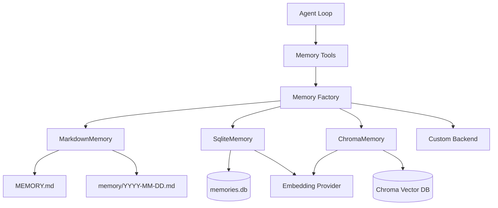
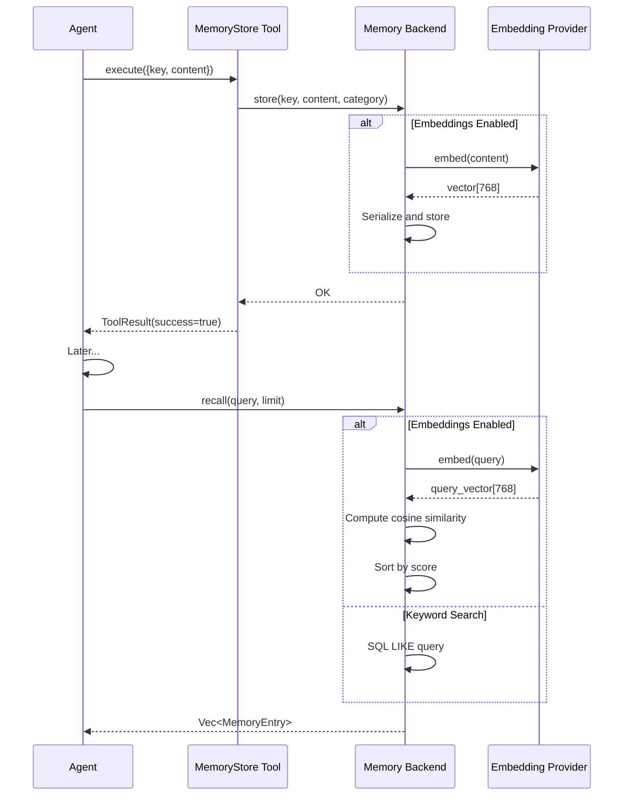

# Memory System

The Memory system provides persistent storage for facts, decisions, and conversation context. Multiple backends (Markdown, SQLite, vector databases) can be used interchangeably through a uniform trait interface.

## Architecture Overview



## Memory Trait

All backends implement the `Memory` trait from `src/memory/traits.rs`:

```rust
#[async_trait]
pub trait Memory: Send + Sync {
    /// Backend name
    fn name(&self) -> &str;

    /// Store a memory entry, optionally scoped to a session
    async fn store(
        &self,
        key: &str,
        content: &str,
        category: MemoryCategory,
        session_id: Option<&str>,
    ) -> anyhow::Result<()>;

    /// Recall memories matching a query (keyword search)
    async fn recall(
        &self,
        query: &str,
        limit: usize,
        session_id: Option<&str>,
    ) -> anyhow::Result<Vec<MemoryEntry>>;

    /// Get a specific memory by key
    async fn get(&self, key: &str) -> anyhow::Result<Option<MemoryEntry>>;

    /// List all memory keys, optionally filtered
    async fn list(
        &self,
        category: Option<&MemoryCategory>,
        session_id: Option<&str>,
    ) -> anyhow::Result<Vec<MemoryEntry>>;

    /// Remove a memory by key
    async fn forget(&self, key: &str) -> anyhow::Result<bool>;

    /// Count total memories
    async fn count(&self) -> anyhow::Result<usize>;

    /// Health check
    async fn health_check(&self) -> bool;

    /// Rebuild embeddings (vector backends)
    async fn reindex(
        &self,
        progress_callback: Option<Box<dyn Fn(usize, usize) + Send + Sync>>,
    ) -> anyhow::Result<usize> {
        anyhow::bail!("Reindex not supported by {} backend", self.name())
    }
}
```

## Memory Categories

```rust
#[derive(Debug, Clone, Serialize, Deserialize, PartialEq, Eq)]
#[serde(rename_all = "snake_case")]
pub enum MemoryCategory {
    /// Long-term facts, preferences, decisions
    Core,
    /// Daily session logs
    Daily,
    /// Conversation context
    Conversation,
    /// User-defined custom category
    Custom(String),
}
```

## Memory Entry

```rust
#[derive(Clone, Serialize, Deserialize)]
pub struct MemoryEntry {
    pub id: String,
    pub key: String,
    pub content: String,
    pub category: MemoryCategory,
    pub timestamp: String,
    pub session_id: Option<String>,
    pub score: Option<f64>, // For vector similarity search
}
```

## Markdown Memory Implementation

Real implementation from `src/memory/markdown.rs`:

```rust
pub struct MarkdownMemory {
    workspace_dir: PathBuf,
}

impl MarkdownMemory {
    pub fn new(workspace_dir: &Path) -> Self {
        Self {
            workspace_dir: workspace_dir.to_path_buf(),
        }
    }

    fn memory_dir(&self) -> PathBuf {
        self.workspace_dir.join("memory")
    }

    fn core_path(&self) -> PathBuf {
        self.workspace_dir.join("MEMORY.md")
    }

    fn daily_path(&self) -> PathBuf {
        let date = Local::now().format("%Y-%m-%d").to_string();
        self.memory_dir().join(format!("{date}.md"))
    }

    async fn append_to_file(&self, path: &Path, content: &str) -> anyhow::Result<()> {
        self.ensure_dirs().await?;

        let existing = if path.exists() {
            fs::read_to_string(path).await.unwrap_or_default()
        } else {
            String::new()
        };

        let updated = if existing.is_empty() {
            let header = if path == self.core_path() {
                "# Long-Term Memory\n\n"
            } else {
                let date = Local::now().format("%Y-%m-%d").to_string();
                &format!("# Daily Log — {date}\n\n")
            };
            format!("{header}{content}\n")
        } else {
            format!("{existing}\n{content}\n")
        };

        fs::write(path, updated).await?;
        Ok(())
    }
}

#[async_trait]
impl Memory for MarkdownMemory {
    fn name(&self) -> &str {
        "markdown"
    }

    async fn store(
        &self,
        key: &str,
        content: &str,
        category: MemoryCategory,
        _session_id: Option<&str>,
    ) -> anyhow::Result<()> {
        let entry = format!("- **{key}**: {content}");
        
        let path = match category {
            MemoryCategory::Core => self.core_path(),
            MemoryCategory::Daily => self.daily_path(),
            MemoryCategory::Conversation => {
                // Store in daily log with conversation prefix
                let entry = format!("- [Conversation] **{key}**: {content}");
                self.append_to_file(&self.daily_path(), &entry).await?;
                return Ok(());
            }
            MemoryCategory::Custom(ref name) => {
                self.memory_dir().join(format!("{}.md", name))
            }
        };
        
        self.append_to_file(&path, &entry).await
    }

    async fn recall(
        &self,
        query: &str,
        limit: usize,
        _session_id: Option<&str>,
    ) -> anyhow::Result<Vec<MemoryEntry>> {
        let all = self.read_all_entries().await?;
        let query_lower = query.to_lowercase();
        
        let mut matches: Vec<_> = all.into_iter()
            .filter(|entry| {
                entry.content.to_lowercase().contains(&query_lower)
                    || entry.key.to_lowercase().contains(&query_lower)
            })
            .collect();
            
        matches.truncate(limit);
        Ok(matches)
    }

    async fn get(&self, key: &str) -> anyhow::Result<Option<MemoryEntry>> {
        let all = self.read_all_entries().await?;
        Ok(all.into_iter().find(|e| e.key == key))
    }

    async fn list(
        &self,
        category: Option<&MemoryCategory>,
        _session_id: Option<&str>,
    ) -> anyhow::Result<Vec<MemoryEntry>> {
        let all = self.read_all_entries().await?;
        
        if let Some(cat) = category {
            Ok(all.into_iter().filter(|e| &e.category == cat).collect())
        } else {
            Ok(all)
        }
    }

    async fn forget(&self, key: &str) -> anyhow::Result<bool> {
        // Not implemented for markdown (manual editing)
        Ok(false)
    }

    async fn count(&self) -> anyhow::Result<usize> {
        let all = self.read_all_entries().await?;
        Ok(all.len())
    }

    async fn health_check(&self) -> bool {
        self.workspace_dir.exists()
    }
}
```

### File Layout

```
workspace/
├── MEMORY.md           # Long-term core memories
└── memory/
    ├── 2026-03-01.md   # Daily log
    ├── 2026-03-02.md
    └── 2026-03-03.md
```

**MEMORY.md:**
```markdown
# Long-Term Memory

- **user_name**: Alice
- **preferred_language**: Rust
- **workspace**: /home/alice/project
```

**memory/2026-03-03.md:**
```markdown
# Daily Log — 2026-03-03

- **bug_fix**: Fixed memory leak in provider connection pool
- **feature**: Added support for Gemini provider
- [Conversation] **context_1**: User asked about trait system
```

## SQLite Memory with Embeddings

The SQLite backend supports vector similarity search:

```rust
pub struct SqliteMemory {
    pool: SqlitePool,
    embedding_provider: Option<Arc<dyn EmbeddingProvider>>,
}

impl SqliteMemory {
    pub async fn new(db_path: &Path) -> anyhow::Result<Self> {
        let pool = SqlitePool::connect(db_path.to_str().unwrap()).await?;
        
        // Create schema
        sqlx::query(
            r#"
            CREATE TABLE IF NOT EXISTS memories (
                id TEXT PRIMARY KEY,
                key TEXT NOT NULL,
                content TEXT NOT NULL,
                category TEXT NOT NULL,
                timestamp TEXT NOT NULL,
                session_id TEXT,
                embedding BLOB
            );
            CREATE INDEX IF NOT EXISTS idx_key ON memories(key);
            CREATE INDEX IF NOT EXISTS idx_category ON memories(category);
            CREATE INDEX IF NOT EXISTS idx_session ON memories(session_id);
            "#
        )
        .execute(&pool)
        .await?;
        
        Ok(Self {
            pool,
            embedding_provider: None,
        })
    }
    
    pub fn with_embeddings(mut self, provider: Arc<dyn EmbeddingProvider>) -> Self {
        self.embedding_provider = Some(provider);
        self
    }
}

#[async_trait]
impl Memory for SqliteMemory {
    async fn store(
        &self,
        key: &str,
        content: &str,
        category: MemoryCategory,
        session_id: Option<&str>,
    ) -> anyhow::Result<()> {
        let id = uuid::Uuid::new_v4().to_string();
        let timestamp = chrono::Utc::now().to_rfc3339();
        let category_str = category.to_string();
        
        // Generate embedding if provider available
        let embedding = if let Some(provider) = &self.embedding_provider {
            let vec = provider.embed(content).await?;
            Some(bincode::serialize(&vec)?)
        } else {
            None
        };
        
        sqlx::query(
            r#"
            INSERT INTO memories (id, key, content, category, timestamp, session_id, embedding)
            VALUES (?, ?, ?, ?, ?, ?, ?)
            "#
        )
        .bind(&id)
        .bind(key)
        .bind(content)
        .bind(&category_str)
        .bind(&timestamp)
        .bind(session_id)
        .bind(embedding)
        .execute(&self.pool)
        .await?;
        
        Ok(())
    }
    
    async fn recall(
        &self,
        query: &str,
        limit: usize,
        session_id: Option<&str>,
    ) -> anyhow::Result<Vec<MemoryEntry>> {
        // Use vector similarity if embeddings available
        if let Some(provider) = &self.embedding_provider {
            let query_vec = provider.embed(query).await?;
            
            // Fetch all entries with embeddings
            let rows = if let Some(sid) = session_id {
                sqlx::query_as::<_, (String, String, String, String, String, Option<String>, Option<Vec<u8>>)>(
                    "SELECT id, key, content, category, timestamp, session_id, embedding FROM memories WHERE session_id = ? AND embedding IS NOT NULL"
                )
                .bind(sid)
                .fetch_all(&self.pool)
                .await?
            } else {
                sqlx::query_as(
                    "SELECT id, key, content, category, timestamp, session_id, embedding FROM memories WHERE embedding IS NOT NULL"
                )
                .fetch_all(&self.pool)
                .await?
            };
            
            // Calculate cosine similarity
            let mut scored: Vec<_> = rows.into_iter()
                .filter_map(|(id, key, content, cat, ts, sid, emb)| {
                    let embedding: Vec<f32> = bincode::deserialize(&emb?).ok()?;
                    let score = cosine_similarity(&query_vec, &embedding);
                    
                    Some((score, MemoryEntry {
                        id,
                        key,
                        content,
                        category: parse_category(&cat),
                        timestamp: ts,
                        session_id: sid,
                        score: Some(score),
                    }))
                })
                .collect();
            
            // Sort by similarity descending
            scored.sort_by(|a, b| b.0.partial_cmp(&a.0).unwrap());
            scored.truncate(limit);
            
            return Ok(scored.into_iter().map(|(_, entry)| entry).collect());
        }
        
        // Fallback to keyword search
        let pattern = format!("%{}%", query);
        let rows = if let Some(sid) = session_id {
            sqlx::query_as(
                "SELECT id, key, content, category, timestamp, session_id FROM memories WHERE session_id = ? AND (content LIKE ? OR key LIKE ?) LIMIT ?"
            )
            .bind(sid)
            .bind(&pattern)
            .bind(&pattern)
            .bind(limit as i64)
            .fetch_all(&self.pool)
            .await?
        } else {
            sqlx::query_as(
                "SELECT id, key, content, category, timestamp, session_id FROM memories WHERE content LIKE ? OR key LIKE ? LIMIT ?"
            )
            .bind(&pattern)
            .bind(&pattern)
            .bind(limit as i64)
            .fetch_all(&self.pool)
            .await?
        };
        
        Ok(rows.into_iter().map(|(id, key, content, cat, ts, sid)| MemoryEntry {
            id,
            key,
            content,
            category: parse_category(&cat),
            timestamp: ts,
            session_id: sid,
            score: None,
        }).collect())
    }
    
    async fn reindex(
        &self,
        progress_callback: Option<Box<dyn Fn(usize, usize) + Send + Sync>>,
    ) -> anyhow::Result<usize> {
        let provider = self.embedding_provider.as_ref()
            .ok_or_else(|| anyhow::anyhow!("No embedding provider configured"))?;
        
        // Fetch all entries without embeddings
        let rows: Vec<(String, String)> = sqlx::query_as(
            "SELECT id, content FROM memories WHERE embedding IS NULL"
        )
        .fetch_all(&self.pool)
        .await?;
        
        let total = rows.len();
        
        for (i, (id, content)) in rows.into_iter().enumerate() {
            let vec = provider.embed(&content).await?;
            let embedding = bincode::serialize(&vec)?;
            
            sqlx::query("UPDATE memories SET embedding = ? WHERE id = ?")
                .bind(embedding)
                .bind(&id)
                .execute(&self.pool)
                .await?;
            
            if let Some(ref cb) = progress_callback {
                cb(i + 1, total);
            }
        }
        
        Ok(total)
    }
}

fn cosine_similarity(a: &[f32], b: &[f32]) -> f64 {
    let dot: f32 = a.iter().zip(b.iter()).map(|(x, y)| x * y).sum();
    let mag_a: f32 = a.iter().map(|x| x * x).sum::<f32>().sqrt();
    let mag_b: f32 = b.iter().map(|x| x * x).sum::<f32>().sqrt();
    (dot / (mag_a * mag_b)) as f64
}
```

## Session Management

Memories can be scoped to conversation sessions:

```rust
pub struct Session {
    pub id: String,
    pub user_id: String,
    pub channel: String,
    pub started_at: DateTime<Utc>,
    pub last_activity: DateTime<Utc>,
}

pub struct SessionManager {
    sessions: Arc<RwLock<HashMap<String, Session>>>,
}

impl SessionManager {
    pub fn get_or_create(&self, user_id: &str, channel: &str) -> String {
        let key = format!("{}:{}", channel, user_id);
        let mut sessions = self.sessions.write().unwrap();
        
        if let Some(session) = sessions.get_mut(&key) {
            session.last_activity = Utc::now();
            return session.id.clone();
        }
        
        let session = Session {
            id: uuid::Uuid::new_v4().to_string(),
            user_id: user_id.to_string(),
            channel: channel.to_string(),
            started_at: Utc::now(),
            last_activity: Utc::now(),
        };
        
        let id = session.id.clone();
        sessions.insert(key, session);
        id
    }
}
```

## Memory Configuration

```toml
[memory]
backend = "sqlite"
path = "~/.local/share/zeroclaw/memory.db"

# Optional embedding provider for semantic search
[memory.embeddings]
provider = "openai"
model = "text-embedding-3-small"
```

## Memory Lifecycle



## Best Practices

### Storage Strategy

- **Core**: Long-term facts, user preferences, important decisions
- **Daily**: Session logs, temporary context, work-in-progress
- **Conversation**: Short-term context, current thread state

### Recall Optimization

- Use embeddings for semantic search
- Limit results to relevant subset (5-10 entries)
- Scope to session when appropriate
- Prefer specific queries over broad searches

### Maintenance

- Periodically review and prune daily logs
- Migrate important daily entries to core
- Reindex embeddings after model changes
- Back up memory database regularly

## Next Steps

- [Security](./security.mdx) - Security architecture and policy enforcement
