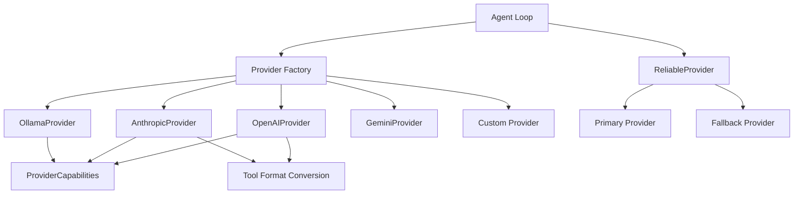

# Provider System

The Provider system abstracts model inference backends behind a uniform interface, enabling ZeroClaw to work with any LLM provider (OpenAI, Anthropic, local models, etc.) through a single consistent API.

## Architecture Overview



## Provider Trait

All providers implement the `Provider` trait from `src/providers/traits.rs`:

```rust
#[async_trait]
pub trait Provider: Send + Sync {
    /// Query provider capabilities
    fn capabilities(&self) -> ProviderCapabilities {
        ProviderCapabilities::default()
    }

    /// Convert tool specs to provider-native format
    fn convert_tools(&self, tools: &[ToolSpec]) -> ToolsPayload {
        ToolsPayload::PromptGuided {
            instructions: build_tool_instructions_text(tools),
        }
    }

    /// Simple one-shot chat (single user message)
    async fn simple_chat(
        &self,
        message: &str,
        model: &str,
        temperature: f64,
    ) -> anyhow::Result<String>;

    /// Chat with optional system prompt
    async fn chat_with_system(
        &self,
        system_prompt: Option<&str>,
        message: &str,
        model: &str,
        temperature: f64,
    ) -> anyhow::Result<String>;

    /// Multi-turn conversation with history
    async fn chat_with_history(
        &self,
        messages: &[ChatMessage],
        model: &str,
        temperature: f64,
    ) -> anyhow::Result<String>;

    /// Structured chat API for agent loop
    async fn chat(
        &self,
        request: ChatRequest<'_>,
        model: &str,
        temperature: f64,
    ) -> anyhow::Result<ChatResponse>;

    /// Whether provider supports native tool calls
    fn supports_native_tools(&self) -> bool {
        self.capabilities().native_tool_calling
    }

    /// Whether provider supports vision/image inputs
    fn supports_vision(&self) -> bool {
        self.capabilities().vision
    }

    /// Warm up HTTP connection pool
    async fn warmup(&self) -> anyhow::Result<()> {
        Ok(())
    }
}
```

## Provider Capabilities

Providers declare capabilities to enable intelligent adaptation:

```rust
#[derive(Debug, Clone, Default, PartialEq, Eq)]
pub struct ProviderCapabilities {
    /// Native tool calling via API primitives
    pub native_tool_calling: bool,
    /// Vision / image input support
    pub vision: bool,
}
```

### Native Tool Calling

Providers that support native tool calling return structured tool calls:

```rust
pub struct ChatResponse {
    pub text: Option<String>,
    pub tool_calls: Vec<ToolCall>,
    pub usage: Option<TokenUsage>,
    pub reasoning_content: Option<String>,
    pub stop_reason: Option<NormalizedStopReason>,
}

pub struct ToolCall {
    pub id: String,
    pub name: String,
    pub arguments: String, // JSON-encoded
}
```

**Native Tool Calling Providers:**
- OpenAI (GPT-4, GPT-3.5)
- Anthropic (Claude)
- Gemini
- Azure OpenAI

### Prompt-Guided Tool Calling

Providers without native tool support use prompt injection:

```rust
pub enum ToolsPayload {
    /// Native formats
    OpenAI { tools: Vec<serde_json::Value> },
    Anthropic { tools: Vec<serde_json::Value> },
    Gemini { function_declarations: Vec<serde_json::Value> },
    
    /// Fallback: inject as text in system prompt
    PromptGuided { instructions: String },
}
```

**Prompt-Guided Example:**

```markdown
## Tool Use Protocol

To use a tool, wrap a JSON object in <tool_call></tool_call> tags:

<tool_call>
{"name": "shell", "arguments": {"command": "ls -la"}}
</tool_call>

### Available Tools

**shell**: Execute a shell command in the workspace directory
Parameters: `{"type":"object","properties":{"command":{"type":"string"}}}`

**file_read**: Read contents of a file
Parameters: `{"type":"object","properties":{"path":{"type":"string"}}}`
```

## OpenAI Provider Implementation

Real implementation from `src/providers/openai.rs`:

```rust
pub struct OpenAiProvider {
    base_url: String,
    credential: Option<String>,
    max_tokens_override: Option<u32>,
}

impl OpenAiProvider {
    pub fn new(base_url: impl Into<String>, api_key: Option<String>) -> Self {
        Self {
            base_url: base_url.into(),
            credential: api_key,
            max_tokens_override: None,
        }
    }
}

#[async_trait]
impl Provider for OpenAiProvider {
    fn capabilities(&self) -> ProviderCapabilities {
        ProviderCapabilities {
            native_tool_calling: true,
            vision: true,
        }
    }

    fn convert_tools(&self, tools: &[ToolSpec]) -> ToolsPayload {
        let native_tools: Vec<_> = tools
            .iter()
            .map(|spec| {
                serde_json::json!({
                    "type": "function",
                    "function": {
                        "name": spec.name,
                        "description": spec.description,
                        "parameters": spec.parameters,
                    }
                })
            })
            .collect();
        
        ToolsPayload::OpenAI { tools: native_tools }
    }

    async fn chat_with_system(
        &self,
        system_prompt: Option<&str>,
        message: &str,
        model: &str,
        temperature: f64,
    ) -> anyhow::Result<String> {
        let mut messages = Vec::new();
        
        if let Some(sys) = system_prompt {
            messages.push(Message {
                role: "system".into(),
                content: sys.into(),
            });
        }
        
        messages.push(Message {
            role: "user".into(),
            content: message.into(),
        });
        
        let client = Client::new();
        let request = ChatRequest {
            model: model.to_string(),
            messages,
            temperature,
            max_tokens: self.max_tokens_override,
        };
        
        let response = client
            .post(format!("{}/chat/completions", self.base_url))
            .header("Authorization", format!("Bearer {}", self.credential.as_deref().unwrap_or("")))
            .json(&request)
            .send()
            .await?
            .json::<ChatResponse>()
            .await?;
        
        let content = response
            .choices
            .first()
            .and_then(|c| c.message.content.as_deref())
            .unwrap_or("");
        
        Ok(content.to_string())
    }
    
    async fn chat(
        &self,
        request: ChatRequest<'_>,
        model: &str,
        temperature: f64,
    ) -> anyhow::Result<ChatResponse> {
        // Convert tools to OpenAI format
        let tools = request.tools.map(|tools| {
            match self.convert_tools(tools) {
                ToolsPayload::OpenAI { tools } => tools,
                _ => vec![],
            }
        });
        
        // Build native request with tool definitions
        let native_request = NativeChatRequest {
            model: model.to_string(),
            messages: convert_messages(request.messages),
            temperature,
            max_tokens: self.max_tokens_override,
            tools,
            tool_choice: None,
        };
        
        // Send to API and parse response
        let response = self.send_request(native_request).await?;
        
        // Extract tool calls
        let tool_calls = response.choices
            .first()
            .and_then(|c| c.message.tool_calls.as_ref())
            .map(|calls| {
                calls.iter().map(|tc| ToolCall {
                    id: tc.id.clone().unwrap_or_default(),
                    name: tc.function.name.clone(),
                    arguments: tc.function.arguments.clone(),
                }).collect()
            })
            .unwrap_or_default();
        
        Ok(ChatResponse {
            text: response.choices.first().and_then(|c| c.message.content.clone()),
            tool_calls,
            usage: response.usage.map(|u| TokenUsage {
                input_tokens: u.prompt_tokens,
                output_tokens: u.completion_tokens,
            }),
            reasoning_content: None,
            quota_metadata: None,
            stop_reason: response.choices.first()
                .and_then(|c| c.finish_reason.as_deref())
                .map(NormalizedStopReason::from_openai_finish_reason),
            raw_stop_reason: response.choices.first()
                .and_then(|c| c.finish_reason.clone()),
        })
    }
}
```

## Provider Factory

Providers are instantiated via factory function in `src/providers/mod.rs`:

```rust
pub fn create_provider(
    name: &str,
    base_url: Option<&str>,
    api_key: Option<String>,
    config: &Config,
) -> Result<Box<dyn Provider>> {
    match name {
        "openai" => {
            let url = base_url.unwrap_or("https://api.openai.com/v1");
            Ok(Box::new(OpenAiProvider::new(url, api_key)))
        }
        
        "anthropic" => {
            let url = base_url.unwrap_or("https://api.anthropic.com");
            Ok(Box::new(AnthropicProvider::new(url, api_key)))
        }
        
        "ollama" => {
            let url = base_url.unwrap_or("http://localhost:11434");
            Ok(Box::new(OllamaProvider::new(url)))
        }
        
        "gemini" => {
            let url = base_url.unwrap_or("https://generativelanguage.googleapis.com");
            Ok(Box::new(GeminiProvider::new(url, api_key)))
        }
        
        _ => Err(anyhow::anyhow!("Unknown provider: {}", name)),
    }
}
```

## Reliable Provider Wrapper

The `ReliableProvider` wrapper adds fallback chains and retry logic:

```rust
pub struct ReliableProvider {
    primary: Box<dyn Provider>,
    fallbacks: Vec<Box<dyn Provider>>,
    max_retries: u32,
}

impl ReliableProvider {
    pub fn new(
        primary: Box<dyn Provider>,
        fallbacks: Vec<Box<dyn Provider>>,
    ) -> Self {
        Self {
            primary,
            fallbacks,
            max_retries: 3,
        }
    }
}

#[async_trait]
impl Provider for ReliableProvider {
    async fn chat_with_system(
        &self,
        system_prompt: Option<&str>,
        message: &str,
        model: &str,
        temperature: f64,
    ) -> anyhow::Result<String> {
        // Try primary
        match self.primary.chat_with_system(system_prompt, message, model, temperature).await {
            Ok(response) => return Ok(response),
            Err(e) => eprintln!("Primary provider failed: {}", e),
        }
        
        // Try fallbacks
        for (i, fallback) in self.fallbacks.iter().enumerate() {
            match fallback.chat_with_system(system_prompt, message, model, temperature).await {
                Ok(response) => {
                    eprintln!("Fallback {} succeeded", i);
                    return Ok(response);
                }
                Err(e) => eprintln!("Fallback {} failed: {}", i, e),
            }
        }
        
        Err(anyhow::anyhow!("All providers failed"))
    }
}
```

## Stop Reason Normalization

Providers normalize stop reasons to a common enum:

```rust
#[derive(Debug, Clone, PartialEq, Eq)]
pub enum NormalizedStopReason {
    EndTurn,
    ToolCall,
    MaxTokens,
    ContextWindowExceeded,
    SafetyBlocked,
    Cancelled,
    Unknown(String),
}

impl NormalizedStopReason {
    pub fn from_openai_finish_reason(raw: &str) -> Self {
        match raw.trim().to_ascii_lowercase().as_str() {
            "stop" => Self::EndTurn,
            "tool_calls" | "function_call" => Self::ToolCall,
            "length" | "max_tokens" => Self::MaxTokens,
            "content_filter" => Self::SafetyBlocked,
            "cancelled" | "canceled" => Self::Cancelled,
            _ => Self::Unknown(raw.trim().to_string()),
        }
    }
    
    pub fn from_anthropic_stop_reason(raw: &str) -> Self {
        match raw.trim().to_ascii_lowercase().as_str() {
            "end_turn" | "stop_sequence" => Self::EndTurn,
            "tool_use" => Self::ToolCall,
            "max_tokens" => Self::MaxTokens,
            "model_context_window_exceeded" => Self::ContextWindowExceeded,
            "safety" => Self::SafetyBlocked,
            _ => Self::Unknown(raw.trim().to_string()),
        }
    }
}
```

## Token Usage Tracking

```rust
#[derive(Debug, Clone, Default)]
pub struct TokenUsage {
    pub input_tokens: Option<u64>,
    pub output_tokens: Option<u64>,
}

pub struct ChatResponse {
    pub text: Option<String>,
    pub tool_calls: Vec<ToolCall>,
    pub usage: Option<TokenUsage>, // Populated if provider returns it
    // ...
}
```

## Configuration

Providers are configured in `zeroclaw.toml`:

```toml
[provider]
name = "openai"
api_key = "${OPENAI_API_KEY}"
model = "gpt-4"
temperature = 0.7

# Optional fallback chain
[[provider.fallback]]
name = "anthropic"
api_key = "${ANTHROPIC_API_KEY}"
model = "claude-3-opus-20240229"

[[provider.fallback]]
name = "ollama"
model = "llama2"
base_url = "http://localhost:11434"
```

## Built-in Providers

| Provider | Native Tools | Vision | Streaming | Base URL |
|----------|-------------|---------|-----------|----------|
| OpenAI | ✅ | ✅ | ✅ | https://api.openai.com/v1 |
| Anthropic | ✅ | ✅ | ✅ | https://api.anthropic.com |
| Gemini | ✅ | ✅ | ✅ | https://generativelanguage.googleapis.com |
| Ollama | ❌ | ❌ | ✅ | http://localhost:11434 |
| Azure OpenAI | ✅ | ✅ | ✅ | https://{resource}.openai.azure.com |
| AWS Bedrock | ✅ | ✅ | ✅ | Runtime endpoint |
| OpenRouter | ✅ | Varies | ✅ | https://openrouter.ai/api/v1 |

## Adding a New Provider

From `AGENTS.md` §7.1:

1. **Create provider file**: `src/providers/new_provider.rs`

```rust
use crate::providers::traits::*;
use async_trait::async_trait;

pub struct NewProvider {
    base_url: String,
    api_key: Option<String>,
}

impl NewProvider {
    pub fn new(base_url: impl Into<String>, api_key: Option<String>) -> Self {
        Self {
            base_url: base_url.into(),
            api_key,
        }
    }
}

#[async_trait]
impl Provider for NewProvider {
    fn capabilities(&self) -> ProviderCapabilities {
        ProviderCapabilities {
            native_tool_calling: false, // or true if supported
            vision: false,
        }
    }
    
    async fn chat_with_system(
        &self,
        system_prompt: Option<&str>,
        message: &str,
        model: &str,
        temperature: f64,
    ) -> anyhow::Result<String> {
        // Implement API call
        todo!()
    }
}
```

2. **Register in factory**: `src/providers/mod.rs`

```rust
"new_provider" => {
    let url = base_url.unwrap_or("https://api.example.com");
    Ok(Box::new(NewProvider::new(url, api_key)))
}
```

3. **Add tests**: Test factory wiring and error paths

```rust
#[test]
fn factory_creates_new_provider() {
    let provider = create_provider("new_provider", None, None, &Config::default())
        .expect("factory should create provider");
    assert_eq!(provider.name(), "new_provider");
}
```

4. **Update docs**: Add to `docs/providers-reference.md`

## Best Practices

### Error Handling

- Return structured errors with context
- Distinguish retryable vs. non-retryable errors
- Log API errors at debug level, not error

### Rate Limiting

- Respect provider rate limits
- Implement exponential backoff
- Surface rate limit errors to user

### Security

- Never log API keys or tokens
- Use environment variables for credentials
- Validate API responses before parsing

### Performance

- Reuse HTTP clients (connection pooling)
- Implement `warmup()` for connection pre-warming
- Stream responses when possible

## Next Steps

- [Channels](./channels.mdx) - Channel system architecture
- [Tools](./tools.mdx) - Tool system and capabilities
- [Security](./security.mdx) - Security policy and validation
