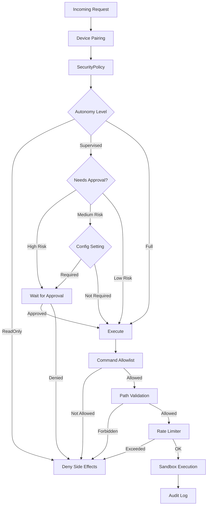

# Security Architecture

ZeroClaw's security architecture follows defense-in-depth principles with multiple layers of validation, sandboxing, and policy enforcement. From `AGENTS.md` §2:

> **Security-critical surfaces are first-class and internet-adjacent**
> - `src/gateway/`, `src/security/`, `src/tools/`, `src/runtime/` carry high blast radius
> - Defaults already lean secure-by-default (pairing, bind safety, limits, secret handling)

## Security Layers



## SecurityPolicy

The core security component from `src/security/policy.rs`:

```rust
#[derive(Debug, Clone)]
pub struct SecurityPolicy {
    pub autonomy: AutonomyLevel,
    pub workspace_dir: PathBuf,
    pub workspace_only: bool,
    pub allowed_commands: Vec<String>,
    pub command_context_rules: Vec<CommandContextRule>,
    pub forbidden_paths: Vec<String>,
    pub allowed_roots: Vec<PathBuf>,
    pub max_actions_per_hour: u32,
    pub max_cost_per_day_cents: u32,
    pub require_approval_for_medium_risk: bool,
    pub block_high_risk_commands: bool,
    pub shell_env_passthrough: Vec<String>,
    pub allow_sensitive_file_reads: bool,
    pub allow_sensitive_file_writes: bool,
    pub tracker: ActionTracker,
}
```

## Autonomy Levels

```rust
#[derive(Debug, Clone, Copy, PartialEq, Eq)]
pub enum AutonomyLevel {
    /// Read-only: can observe but not act
    ReadOnly,
    /// Supervised: acts but requires approval for risky operations
    Supervised,
    /// Full: autonomous execution within policy bounds
    Full,
}
```

### ReadOnly

- All side-effecting operations are blocked
- Only observation tools allowed (file_read, memory_recall)
- Useful for testing or demonstration mode

### Supervised (Default)

- Default autonomy level
- High-risk commands require explicit approval
- Medium-risk commands require approval if configured
- Approval can be given via channel interaction or `approved=true` parameter

### Full

- Autonomous execution within policy bounds
- Still subject to command allowlist, path validation, rate limits
- Recommended only for trusted environments

## Command Validation

Multi-layered command validation from `src/security/policy.rs`:

### 1. Syntax Blocking

```rust
pub fn evaluate_command_allowlist(&self, command: &str) -> Result<(), String> {
    // Block subshell operators
    if command.contains('`') || contains_unquoted_shell_variable_expansion(command) {
        return Err("Disallowed shell expansion syntax".into());
    }
    
    // Block redirections
    if contains_unquoted_char(command, '>') || contains_unquoted_char(command, '<') {
        return Err("Disallowed redirection syntax".into());
    }
    
    // Block background chaining
    if contains_unquoted_single_ampersand(command) {
        return Err("Disallowed background operator '&'".into());
    }
    
    // Block tee
    if command.split_whitespace().any(|w| w == "tee") {
        return Err("Disallowed tee usage".into());
    }
    
    // ... continue validation
}
```

### 2. Command Allowlist

```rust
impl Default for SecurityPolicy {
    fn default() -> Self {
        Self {
            allowed_commands: vec![
                "git".into(),
                "npm".into(),
                "cargo".into(),
                "mkdir".into(),
                "touch".into(),
                "cp".into(),
                "mv".into(),
                "ls".into(),
                "cat".into(),
                "grep".into(),
                "find".into(),
                "echo".into(),
                "pwd".into(),
                "wc".into(),
                "head".into(),
                "tail".into(),
                "date".into(),
            ],
            // ...
        }
    }
}
```

### 3. Argument Validation

```rust
fn is_args_safe(&self, base: &str, args: &[String]) -> bool {
    match base {
        "find" => {
            // Block -exec and -ok
            !args.iter().any(|arg| arg == "-exec" || arg == "-ok")
        }
        "git" => {
            // Block global -c/--config injection
            if args.iter().any(|arg| arg == "-c" || arg.starts_with("--config=")) {
                return false;
            }
            
            // For git config, only allow read-only operations
            if args.first().map(|s| s.as_str()) == Some("config") {
                let has_readonly = args.iter().any(|arg| {
                    matches!(arg.as_str(), "--get" | "--list" | "-l" | "--get-all")
                });
                let has_write = args.iter().any(|arg| {
                    matches!(arg.as_str(), "--add" | "--replace-all" | "--unset" | "--edit")
                });
                return has_readonly && !has_write;
            }
            
            true
        }
        _ => true,
    }
}
```

### 4. Risk Classification

```rust
#[derive(Debug, Clone, Copy, PartialEq, Eq)]
pub enum CommandRiskLevel {
    Low,
    Medium,
    High,
}

pub fn command_risk_level(&self, command: &str) -> CommandRiskLevel {
    // High-risk commands
    if matches!(base, "rm" | "dd" | "sudo" | "curl" | "wget" | "ssh") {
        return CommandRiskLevel::High;
    }
    
    // Check for dangerous patterns
    if command.contains("rm -rf /") || command.contains(":(){:|:&};:") {
        return CommandRiskLevel::High;
    }
    
    // Medium-risk: state-changing but not destructive
    match base {
        "git" if args.first() == Some(&"push") => CommandRiskLevel::Medium,
        "npm" if matches!(args.first().map(|s| s.as_str()), Some("install" | "publish")) => {
            CommandRiskLevel::Medium
        }
        "cargo" if matches!(args.first().map(|s| s.as_str()), Some("publish" | "install")) => {
            CommandRiskLevel::Medium
        }
        "touch" | "mkdir" | "mv" | "cp" => CommandRiskLevel::Medium,
        _ => CommandRiskLevel::Low,
    }
}
```

## Path Validation

```rust
pub fn is_path_allowed(&self, path: &str) -> bool {
    // Block null bytes (C-syscall truncation)
    if path.contains('\0') {
        return false;
    }
    
    // Block path traversal (..)
    if Path::new(path)
        .components()
        .any(|c| matches!(c, Component::ParentDir))
    {
        return false;
    }
    
    // Block URL-encoded traversal
    let lower = path.to_lowercase();
    if lower.contains("..%2f") || lower.contains("%2f..") {
        return false;
    }
    
    // Reject ~user forms
    if path.starts_with('~') && path != "~" && !path.starts_with("~/") {
        return false;
    }
    
    // Expand ~ to home directory
    let expanded = expand_user_path(path);
    
    // Block absolute paths in workspace_only mode
    if self.workspace_only && expanded.is_absolute() {
        return false;
    }
    
    // Check forbidden paths
    for forbidden in &self.forbidden_paths {
        let forbidden_path = expand_user_path(forbidden);
        if expanded.starts_with(&forbidden_path) {
            return false;
        }
    }
    
    true
}

/// Validate resolved canonical path
pub fn is_resolved_path_allowed(&self, resolved: &Path) -> bool {
    let workspace_root = self.workspace_dir
        .canonicalize()
        .unwrap_or_else(|_| self.workspace_dir.clone());
    
    // Check if in workspace
    if resolved.starts_with(&workspace_root) {
        return true;
    }
    
    // Check allowed roots (e.g., skills directories)
    for root in &self.allowed_roots {
        let canonical = root.canonicalize().unwrap_or_else(|_| root.clone());
        if resolved.starts_with(&canonical) {
            return true;
        }
    }
    
    // Check forbidden paths
    for forbidden in &self.forbidden_paths {
        let forbidden_path = expand_user_path(forbidden);
        if resolved.starts_with(&forbidden_path) {
            return false;
        }
    }
    
    // Respect workspace_only setting
    !self.workspace_only
}
```

### Default Forbidden Paths

```rust
forbidden_paths: vec![
    // System directories
    "/etc", "/root", "/home", "/usr", "/bin", "/sbin",
    "/lib", "/opt", "/boot", "/dev", "/proc", "/sys",
    "/var", "/tmp", "/mnt",
    
    // Sensitive dotfiles
    "~/.ssh", "~/.gnupg", "~/.aws", "~/.config",
]
```

## Rate Limiting

```rust
pub struct ActionTracker {
    actions: Mutex<Vec<Instant>>,
}

impl ActionTracker {
    pub fn record(&self) -> usize {
        let mut actions = self.actions.lock();
        let cutoff = Instant::now() - Duration::from_secs(3600);
        actions.retain(|t| *t > cutoff);
        actions.push(Instant::now());
        actions.len()
    }
    
    pub fn count(&self) -> usize {
        let mut actions = self.actions.lock();
        let cutoff = Instant::now() - Duration::from_secs(3600);
        actions.retain(|t| *t > cutoff);
        actions.len()
    }
}

pub fn record_action(&self) -> bool {
    let count = self.tracker.record();
    count <= self.max_actions_per_hour as usize
}
```

## Device Pairing

From `src/security/pairing.rs`:

```rust
pub struct PairingGuard {
    require_pairing: bool,
    paired_devices: Arc<RwLock<HashSet<String>>>,
    pending_codes: Arc<RwLock<HashMap<String, String>>>,
}

impl PairingGuard {
    pub fn new(require_pairing: bool, pre_paired: &[String]) -> Self {
        Self {
            require_pairing,
            paired_devices: Arc::new(RwLock::new(pre_paired.iter().cloned().collect())),
            pending_codes: Arc::new(RwLock::new(HashMap::new())),
        }
    }
    
    pub fn is_paired(&self, device_id: &str) -> bool {
        self.paired_devices.read().unwrap().contains(device_id)
    }
    
    pub fn generate_pairing_code(&self, device_id: &str) -> String {
        let code = format!("{:06}", rand::random::<u32>() % 1000000);
        self.pending_codes.write().unwrap().insert(device_id.to_string(), code.clone());
        code
    }
    
    pub fn pair_device(&self, device_id: &str, code: &str) -> bool {
        let mut pending = self.pending_codes.write().unwrap();
        if let Some(expected) = pending.get(device_id) {
            if expected == code {
                pending.remove(device_id);
                self.paired_devices.write().unwrap().insert(device_id.to_string());
                return true;
            }
        }
        false
    }
}
```

## Secret Storage

Encrypted credential storage from `src/security/secrets.rs`:

```rust
pub struct SecretStore {
    store_dir: PathBuf,
    require_passphrase: bool,
}

impl SecretStore {
    pub fn new(store_dir: &Path, require_passphrase: bool) -> Self {
        Self {
            store_dir: store_dir.to_path_buf(),
            require_passphrase,
        }
    }
    
    pub fn encrypt(&self, plaintext: &str) -> anyhow::Result<String> {
        // Use age encryption with user's public key
        let pubkey = self.get_or_create_pubkey()?;
        let encrypted = age::encrypt(plaintext.as_bytes(), &pubkey)?;
        Ok(base64::encode(&encrypted))
    }
    
    pub fn decrypt(&self, ciphertext: &str) -> anyhow::Result<String> {
        let encrypted = base64::decode(ciphertext)?;
        let privkey = self.load_privkey()?;
        let plaintext = age::decrypt(&encrypted, &privkey)?;
        Ok(String::from_utf8(plaintext)?)
    }
    
    pub fn store_secret(&self, key: &str, value: &str) -> anyhow::Result<()> {
        let encrypted = self.encrypt(value)?;
        let path = self.store_dir.join(format!("{}.enc", key));
        std::fs::create_dir_all(&self.store_dir)?;
        std::fs::write(path, encrypted)?;
        Ok(())
    }
    
    pub fn load_secret(&self, key: &str) -> anyhow::Result<String> {
        let path = self.store_dir.join(format!("{}.enc", key));
        let encrypted = std::fs::read_to_string(path)?;
        self.decrypt(&encrypted)
    }
}
```

## Sandboxing

OS-level isolation via `Sandbox` trait:

```rust
#[async_trait]
pub trait Sandbox: Send + Sync {
    fn name(&self) -> &str;
    
    async fn execute(
        &self,
        command: &str,
        workspace: &Path,
        env: HashMap<String, String>,
        timeout_secs: u64,
    ) -> anyhow::Result<Output>;
}
```

### Sandbox Backends

- **Docker**: Full container isolation
- **Firejail**: Linux seccomp-based sandbox
- **Bubblewrap**: Unprivileged Linux namespace sandbox
- **Landlock**: Kernel LSM for file access control
- **Native**: Direct execution (least isolation)

### Sandbox Selection

From `src/security/detect.rs`:

```rust
pub fn create_sandbox(config: &Config) -> Arc<dyn Sandbox> {
    // Try configured sandbox first
    if let Some(name) = &config.sandbox {
        match name.as_str() {
            "docker" if is_docker_available() => {
                return Arc::new(DockerSandbox::new());
            }
            "firejail" if is_firejail_available() => {
                return Arc::new(FirejailSandbox::new());
            }
            "landlock" if is_landlock_available() => {
                return Arc::new(LandlockSandbox::new());
            }
            _ => eprintln!("Requested sandbox '{}' not available", name),
        }
    }
    
    // Auto-detect best available
    if is_docker_available() {
        return Arc::new(DockerSandbox::new());
    }
    if is_firejail_available() {
        return Arc::new(FirejailSandbox::new());
    }
    if is_landlock_available() {
        return Arc::new(LandlockSandbox::new());
    }
    
    // Fallback to native
    Arc::new(NoopSandbox::new())
}
```

## Audit Logging

From `src/security/audit.rs`:

```rust
pub struct AuditLogger {
    log_file: PathBuf,
}

#[derive(Debug, Serialize)]
pub struct AuditEvent {
    pub timestamp: DateTime<Utc>,
    pub event_type: AuditEventType,
    pub user_id: String,
    pub channel: String,
    pub details: serde_json::Value,
}

#[derive(Debug, Serialize)]
pub enum AuditEventType {
    CommandExecuted,
    FileAccessed,
    ApprovalRequested,
    ApprovalGranted,
    ApprovalDenied,
    PolicyViolation,
    RateLimitExceeded,
}

impl AuditLogger {
    pub fn log(&self, event: AuditEvent) -> anyhow::Result<()> {
        let json = serde_json::to_string(&event)?;
        let mut file = OpenOptions::new()
            .create(true)
            .append(true)
            .open(&self.log_file)?;
        writeln!(file, "{}", json)?;
        Ok(())
    }
}
```

## Configuration

```toml
[autonomy]
level = "supervised"  # readonly | supervised | full
workspace_dir = "~/workspace"
workspace_only = true
max_actions_per_hour = 100

allowed_commands = [
    "git", "npm", "cargo", "ls", "cat", "grep"
]

forbidden_paths = [
    "~/.ssh", "~/.aws", "/etc"
]

allowed_roots = [
    "/opt/shared-skills"
]

require_approval_for_medium_risk = true
block_high_risk_commands = true

[sandbox]
backend = "docker"  # docker | firejail | landlock | native

[pairing]
require_pairing = true
pre_paired_devices = ["user_12345"]

[secrets]
store_dir = "~/.local/share/zeroclaw/secrets"
require_passphrase = false
```

## Security Best Practices

### Principle of Least Privilege

- Start with Supervised mode
- Expand allowlists incrementally
- Use workspace_only by default
- Restrict command allowlist to needed commands

### Defense in Depth

- Multiple validation layers (syntax → allowlist → args → paths)
- Sandbox isolation even with allowlist
- Rate limiting prevents abuse
- Audit logging for forensics

### Secrets Management

- Use SecretStore for credentials
- Never log secrets or tokens
- Encrypt at rest with age
- Pass via environment variables, not CLI args

### Channel Security

- Require pairing for new devices
- Validate user allowlists
- Verify webhook signatures
- Use HTTPS for all API calls

## Next Steps

- [Architecture](./architecture.mdx) - Overall system design
- [Trait System](./trait-system.mdx) - Extension pattern
- [Tools](./tools.mdx) - Tool security integration
