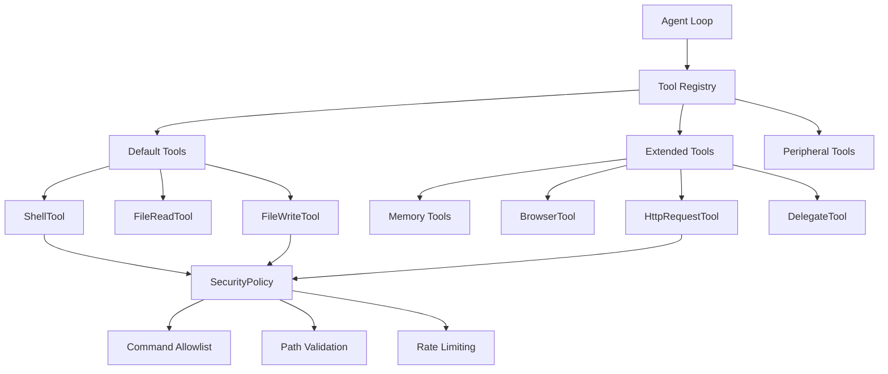
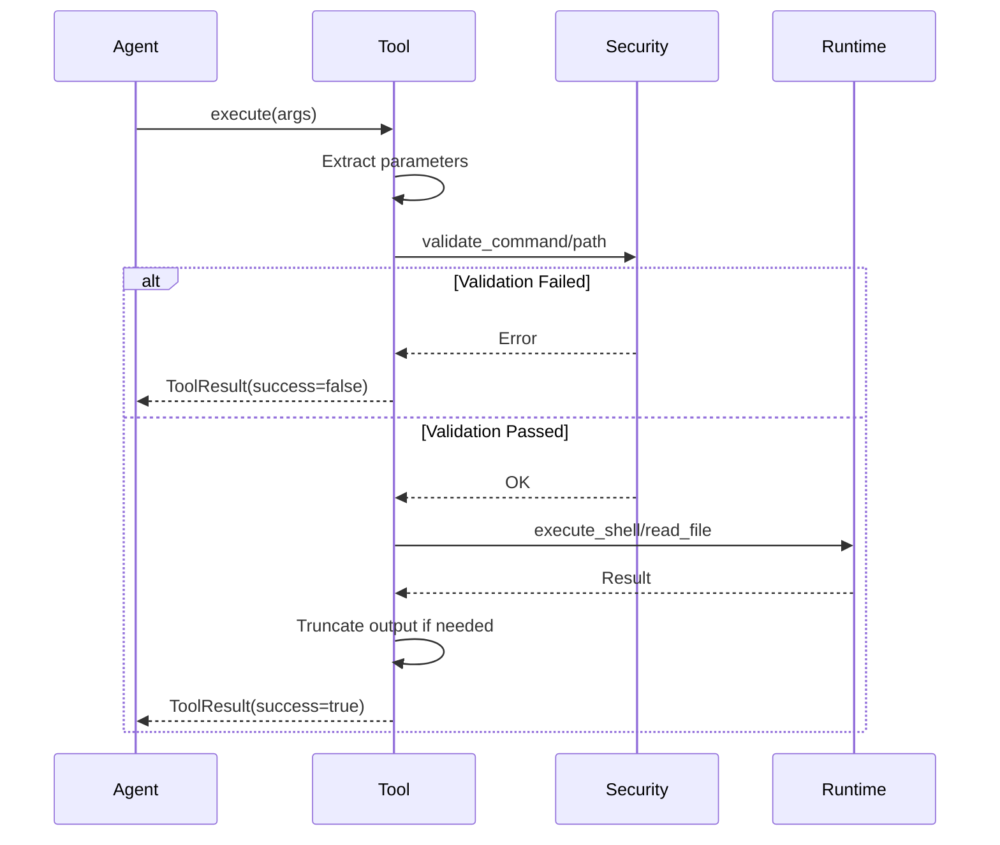

# Tool System

The Tool system defines the capabilities available to the agent during execution. Each tool is a discrete function with a JSON schema, security validation, and structured result format.

## Architecture Overview



## Tool Trait

All tools implement the `Tool` trait from `src/tools/traits.rs`:

```rust
#[async_trait]
pub trait Tool: Send + Sync {
    /// Tool name (used in LLM function calling)
    fn name(&self) -> &str;

    /// Human-readable description
    fn description(&self) -> &str;

    /// JSON schema for parameters
    fn parameters_schema(&self) -> serde_json::Value;

    /// Execute the tool with given arguments
    async fn execute(&self, args: serde_json::Value) -> anyhow::Result<ToolResult>;

    /// Get the full spec for LLM registration
    fn spec(&self) -> ToolSpec {
        ToolSpec {
            name: self.name().to_string(),
            description: self.description().to_string(),
            parameters: self.parameters_schema(),
        }
    }
}
```

### Tool Result

```rust
#[derive(Debug, Clone, Serialize, Deserialize)]
pub struct ToolResult {
    pub success: bool,
    pub output: String,
    pub error: Option<String>,
}
```

### Tool Spec

```rust
#[derive(Debug, Clone, Serialize, Deserialize)]
pub struct ToolSpec {
    pub name: String,
    pub description: String,
    pub parameters: serde_json::Value, // JSON Schema
}
```

## Shell Tool Implementation

Real implementation from `src/tools/shell.rs`:

```rust
const SHELL_TIMEOUT_SECS: u64 = 60;
const MAX_OUTPUT_BYTES: usize = 1_048_576; // 1MB

pub struct ShellTool {
    security: Arc<SecurityPolicy>,
    runtime: Arc<dyn RuntimeAdapter>,
    syscall_detector: Option<Arc<SyscallAnomalyDetector>>,
}

impl ShellTool {
    pub fn new(security: Arc<SecurityPolicy>, runtime: Arc<dyn RuntimeAdapter>) -> Self {
        Self {
            security,
            runtime,
            syscall_detector: None,
        }
    }
}

#[async_trait]
impl Tool for ShellTool {
    fn name(&self) -> &str {
        "shell"
    }

    fn description(&self) -> &str {
        "Execute a shell command in the workspace directory"
    }

    fn parameters_schema(&self) -> serde_json::Value {
        json!({
            "type": "object",
            "properties": {
                "command": {
                    "type": "string",
                    "description": "Shell command to execute"
                },
                "approved": {
                    "type": "boolean",
                    "description": "Explicit approval for high-risk commands",
                    "default": false
                }
            },
            "required": ["command"]
        })
    }

    async fn execute(&self, args: serde_json::Value) -> anyhow::Result<ToolResult> {
        // Extract command from various field names
        let command = extract_command_argument(&args)
            .ok_or_else(|| anyhow::anyhow!("Missing 'command' parameter"))?;
            
        let approved = args.get("approved")
            .and_then(|v| v.as_bool())
            .unwrap_or(false);
        
        // Validate against security policy
        let risk = self.security
            .validate_command_execution(&command, approved)
            .map_err(|e| anyhow::anyhow!("Security policy violation: {}", e))?;
        
        // Check for forbidden paths in arguments
        if let Some(path) = self.security.forbidden_path_argument(&command) {
            return Ok(ToolResult {
                success: false,
                output: String::new(),
                error: Some(format!("Path blocked by security policy: {}", path)),
            });
        }
        
        // Build safe environment
        let allowed_vars = collect_allowed_shell_env_vars(&self.security);
        
        // Execute via runtime adapter
        let result = self.runtime
            .execute_shell(
                &command,
                &self.security.workspace_dir,
                allowed_vars,
                SHELL_TIMEOUT_SECS,
            )
            .await;
        
        match result {
            Ok(output) => {
                let mut stdout = String::from_utf8_lossy(&output.stdout).to_string();
                let mut stderr = String::from_utf8_lossy(&output.stderr).to_string();
                
                // Truncate if too large
                truncate_utf8_to_max_bytes(&mut stdout, MAX_OUTPUT_BYTES);
                truncate_utf8_to_max_bytes(&mut stderr, MAX_OUTPUT_BYTES);
                
                let combined = if stderr.is_empty() {
                    stdout
                } else if stdout.is_empty() {
                    stderr
                } else {
                    format!("stdout:\n{}\n\nstderr:\n{}", stdout, stderr)
                };
                
                Ok(ToolResult {
                    success: output.status.success(),
                    output: combined,
                    error: if output.status.success() { None } else { Some(format!("Exit code: {}", output.status.code().unwrap_or(-1))) },
                })
            }
            Err(e) => Ok(ToolResult {
                success: false,
                output: String::new(),
                error: Some(format!("Execution failed: {}", e)),
            }),
        }
    }
}

fn extract_command_argument(args: &serde_json::Value) -> Option<String> {
    // Try standard "command" field
    if let Some(cmd) = args.get("command").and_then(|v| v.as_str()) {
        return Some(cmd.trim().to_string());
    }
    
    // Try common aliases
    for alias in ["cmd", "script", "shell_command", "bash", "sh"] {
        if let Some(cmd) = args.get(alias).and_then(|v| v.as_str()) {
            return Some(cmd.trim().to_string());
        }
    }
    
    // Try raw string
    args.as_str().map(|s| s.trim().to_string())
}
```

## File Tools

### File Read Tool

```rust
pub struct FileReadTool {
    security: Arc<SecurityPolicy>,
}

#[async_trait]
impl Tool for FileReadTool {
    fn name(&self) -> &str {
        "file_read"
    }

    fn description(&self) -> &str {
        "Read contents of a file"
    }

    fn parameters_schema(&self) -> serde_json::Value {
        json!({
            "type": "object",
            "properties": {
                "path": {
                    "type": "string",
                    "description": "File path (relative to workspace or absolute if allowed)"
                }
            },
            "required": ["path"]
        })
    }

    async fn execute(&self, args: serde_json::Value) -> anyhow::Result<ToolResult> {
        let path = args.get("path")
            .and_then(|v| v.as_str())
            .ok_or_else(|| anyhow::anyhow!("Missing 'path' parameter"))?;
        
        // Validate path against security policy
        if !self.security.is_path_allowed(path) {
            return Ok(ToolResult {
                success: false,
                output: String::new(),
                error: Some(format!("Path not allowed by security policy: {}", path)),
            });
        }
        
        // Resolve relative to workspace
        let full_path = self.security.resolve_user_supplied_path(path);
        
        // Canonicalize and validate final path
        let canonical = match full_path.canonicalize() {
            Ok(p) => p,
            Err(e) => {
                return Ok(ToolResult {
                    success: false,
                    output: String::new(),
                    error: Some(format!("File not found: {}", e)),
                });
            }
        };
        
        if !self.security.is_resolved_path_allowed(&canonical) {
            return Ok(ToolResult {
                success: false,
                output: String::new(),
                error: Some(self.security.resolved_path_violation_message(&canonical)),
            });
        }
        
        // Read file
        match tokio::fs::read_to_string(&canonical).await {
            Ok(content) => Ok(ToolResult {
                success: true,
                output: content,
                error: None,
            }),
            Err(e) => Ok(ToolResult {
                success: false,
                output: String::new(),
                error: Some(format!("Failed to read file: {}", e)),
            }),
        }
    }
}
```

### File Write Tool

```rust
pub struct FileWriteTool {
    security: Arc<SecurityPolicy>,
}

#[async_trait]
impl Tool for FileWriteTool {
    fn name(&self) -> &str {
        "file_write"
    }

    fn description(&self) -> &str {
        "Write content to a file"
    }

    fn parameters_schema(&self) -> serde_json::Value {
        json!({
            "type": "object",
            "properties": {
                "path": {
                    "type": "string",
                    "description": "File path (relative to workspace or absolute if allowed)"
                },
                "content": {
                    "type": "string",
                    "description": "Content to write"
                }
            },
            "required": ["path", "content"]
        })
    }

    async fn execute(&self, args: serde_json::Value) -> anyhow::Result<ToolResult> {
        // Validate autonomy level
        if !self.security.can_act() {
            return Ok(ToolResult {
                success: false,
                output: String::new(),
                error: Some("Read-only mode: cannot write files".to_string()),
            });
        }
        
        let path = args.get("path")
            .and_then(|v| v.as_str())
            .ok_or_else(|| anyhow::anyhow!("Missing 'path' parameter"))?;
            
        let content = args.get("content")
            .and_then(|v| v.as_str())
            .ok_or_else(|| anyhow::anyhow!("Missing 'content' parameter"))?;
        
        // Security validation
        if !self.security.is_path_allowed(path) {
            return Ok(ToolResult {
                success: false,
                output: String::new(),
                error: Some(format!("Path not allowed: {}", path)),
            });
        }
        
        let full_path = self.security.resolve_user_supplied_path(path);
        
        // Create parent directories if needed
        if let Some(parent) = full_path.parent() {
            tokio::fs::create_dir_all(parent).await?;
        }
        
        // Write file
        match tokio::fs::write(&full_path, content).await {
            Ok(_) => Ok(ToolResult {
                success: true,
                output: format!("Wrote {} bytes to {}", content.len(), path),
                error: None,
            }),
            Err(e) => Ok(ToolResult {
                success: false,
                output: String::new(),
                error: Some(format!("Failed to write file: {}", e)),
            }),
        }
    }
}
```

## Memory Tools

Tools that interact with the memory system:

```rust
pub struct MemoryStoreTool {
    memory: Arc<dyn Memory>,
}

#[async_trait]
impl Tool for MemoryStoreTool {
    fn name(&self) -> &str {
        "memory_store"
    }

    fn description(&self) -> &str {
        "Store a fact or decision in long-term memory"
    }

    fn parameters_schema(&self) -> serde_json::Value {
        json!({
            "type": "object",
            "properties": {
                "key": {
                    "type": "string",
                    "description": "Memory key (unique identifier)"
                },
                "content": {
                    "type": "string",
                    "description": "Content to remember"
                },
                "category": {
                    "type": "string",
                    "enum": ["core", "daily", "conversation"],
                    "description": "Memory category",
                    "default": "core"
                }
            },
            "required": ["key", "content"]
        })
    }

    async fn execute(&self, args: serde_json::Value) -> anyhow::Result<ToolResult> {
        let key = args.get("key")
            .and_then(|v| v.as_str())
            .ok_or_else(|| anyhow::anyhow!("Missing 'key' parameter"))?;
            
        let content = args.get("content")
            .and_then(|v| v.as_str())
            .ok_or_else(|| anyhow::anyhow!("Missing 'content' parameter"))?;
            
        let category = args.get("category")
            .and_then(|v| v.as_str())
            .unwrap_or("core");
        
        let category_enum = match category {
            "core" => MemoryCategory::Core,
            "daily" => MemoryCategory::Daily,
            "conversation" => MemoryCategory::Conversation,
            _ => MemoryCategory::Core,
        };
        
        self.memory.store(key, content, category_enum, None).await?;
        
        Ok(ToolResult {
            success: true,
            output: format!("Stored memory: {}", key),
            error: None,
        })
    }
}

pub struct MemoryRecallTool {
    memory: Arc<dyn Memory>,
}

#[async_trait]
impl Tool for MemoryRecallTool {
    fn name(&self) -> &str {
        "memory_recall"
    }

    fn description(&self) -> &str {
        "Search long-term memory for relevant facts"
    }

    fn parameters_schema(&self) -> serde_json::Value {
        json!({
            "type": "object",
            "properties": {
                "query": {
                    "type": "string",
                    "description": "Search query"
                },
                "limit": {
                    "type": "integer",
                    "description": "Maximum number of results",
                    "default": 5
                }
            },
            "required": ["query"]
        })
    }

    async fn execute(&self, args: serde_json::Value) -> anyhow::Result<ToolResult> {
        let query = args.get("query")
            .and_then(|v| v.as_str())
            .ok_or_else(|| anyhow::anyhow!("Missing 'query' parameter"))?;
            
        let limit = args.get("limit")
            .and_then(|v| v.as_u64())
            .unwrap_or(5) as usize;
        
        let results = self.memory.recall(query, limit, None).await?;
        
        if results.is_empty() {
            return Ok(ToolResult {
                success: true,
                output: "No matching memories found".to_string(),
                error: None,
            });
        }
        
        let mut output = format!("Found {} memories:\n\n", results.len());
        for entry in results {
            output.push_str(&format!("- **{}**: {}\n", entry.key, entry.content));
        }
        
        Ok(ToolResult {
            success: true,
            output,
            error: None,
        })
    }
}
```

## Tool Registry

Tools are assembled into registries in `src/tools/mod.rs`:

```rust
/// Default tools (shell, file ops)
pub fn default_tools(
    security: Arc<SecurityPolicy>,
    runtime: Arc<dyn RuntimeAdapter>,
) -> Vec<Box<dyn Tool>> {
    vec![
        Box::new(ShellTool::new(security.clone(), runtime.clone())),
        Box::new(FileReadTool::new(security.clone())),
        Box::new(FileWriteTool::new(security.clone())),
    ]
}

/// All tools (default + extended)
pub fn all_tools(
    security: Arc<SecurityPolicy>,
    runtime: Arc<dyn RuntimeAdapter>,
    memory: Arc<dyn Memory>,
) -> Vec<Box<dyn Tool>> {
    let mut tools = default_tools(security.clone(), runtime.clone());
    
    tools.extend(vec![
        // Memory
        Box::new(MemoryStoreTool::new(memory.clone())),
        Box::new(MemoryRecallTool::new(memory.clone())),
        Box::new(MemoryForgetTool::new(memory.clone())),
        
        // Web
        Box::new(HttpRequestTool::new(security.clone())),
        Box::new(WebFetchTool::new(security.clone())),
        Box::new(BrowserTool::new(security.clone())),
        
        // Delegation
        Box::new(DelegateTool::new(security.clone(), runtime.clone())),
        
        // Scheduling
        Box::new(CronAddTool::new()),
        Box::new(CronListTool::new()),
        Box::new(CronRemoveTool::new()),
    ]);
    
    tools
}
```

## Security Integration

Tools interact with `SecurityPolicy` for validation:

### Command Validation

```rust
pub fn validate_command_execution(
    &self,
    command: &str,
    approved: bool,
) -> Result<CommandRiskLevel, String> {
    // Check allowlist
    if !self.is_command_allowed(command) {
        return Err("Command not in allowlist".into());
    }
    
    // Check forbidden paths
    if let Some(path) = self.forbidden_path_argument(command) {
        return Err(format!("Forbidden path: {}", path));
    }
    
    // Classify risk
    let risk = self.command_risk_level(command);
    
    // Apply autonomy rules
    match risk {
        CommandRiskLevel::High => {
            if self.block_high_risk_commands {
                return Err("High-risk commands are blocked".into());
            }
            if self.autonomy == AutonomyLevel::Supervised && !approved {
                return Err("High-risk command requires approval".into());
            }
        }
        CommandRiskLevel::Medium => {
            if self.autonomy == AutonomyLevel::Supervised
                && self.require_approval_for_medium_risk
                && !approved
            {
                return Err("Medium-risk command requires approval".into());
            }
        }
        CommandRiskLevel::Low => {}
    }
    
    Ok(risk)
}
```

### Path Validation

```rust
pub fn is_path_allowed(&self, path: &str) -> bool {
    // Block null bytes
    if path.contains('\0') {
        return false;
    }
    
    // Block path traversal (..)
    if Path::new(path)
        .components()
        .any(|c| matches!(c, Component::ParentDir))
    {
        return false;
    }
    
    // Expand ~ for home directory
    let expanded = expand_user_path(path);
    
    // Block absolute paths in workspace_only mode
    if self.workspace_only && expanded.is_absolute() {
        return false;
    }
    
    // Check forbidden paths
    for forbidden in &self.forbidden_paths {
        let forbidden_path = expand_user_path(forbidden);
        if expanded.starts_with(forbidden_path) {
            return false;
        }
    }
    
    true
}
```

### Rate Limiting

```rust
pub fn enforce_tool_operation(
    &self,
    operation: ToolOperation,
    operation_name: &str,
) -> Result<(), String> {
    match operation {
        ToolOperation::Read => Ok(()),
        ToolOperation::Act => {
            if !self.can_act() {
                return Err(format!("Read-only mode: cannot perform '{}'", operation_name));
            }
            
            if !self.record_action() {
                return Err("Rate limit exceeded".to_string());
            }
            
            Ok(())
        }
    }
}
```

## Tool Execution Flow



## Adding a New Tool

From `AGENTS.md` §7.3:

1. **Create tool file**: `src/tools/new_tool.rs`

```rust
pub struct NewTool {
    security: Arc<SecurityPolicy>,
}

#[async_trait]
impl Tool for NewTool {
    fn name(&self) -> &str {
        "new_tool"
    }

    fn description(&self) -> &str {
        "Description of what this tool does"
    }

    fn parameters_schema(&self) -> serde_json::Value {
        json!({
            "type": "object",
            "properties": {
                "param1": {
                    "type": "string",
                    "description": "Parameter description"
                }
            },
            "required": ["param1"]
        })
    }

    async fn execute(&self, args: serde_json::Value) -> anyhow::Result<ToolResult> {
        // 1. Extract and validate parameters
        // 2. Apply security checks
        // 3. Execute operation
        // 4. Return structured result
        Ok(ToolResult {
            success: true,
            output: "Result".to_string(),
            error: None,
        })
    }
}
```

2. **Register in mod.rs**:

```rust
Box::new(NewTool::new(security.clone())),
```

3. **Add tests**: Validate parameter schema and execution

## Best Practices

### Parameter Validation

- Use JSON Schema for type safety
- Provide clear descriptions for LLM
- Set sensible defaults
- Handle missing/invalid parameters gracefully

### Security

- Always validate against `SecurityPolicy`
- Check autonomy level for side-effecting operations
- Sanitize all inputs
- Never panic in execute() - return ToolResult with error

### Error Handling

- Return success=false with error message
- Don't expose sensitive information in errors
- Provide actionable error messages
- Log debug info separately

### Output Format

- Keep output concise but informative
- Truncate large outputs (1MB limit)
- Use structured formats when helpful
- Include relevant context in error messages

## Next Steps

- [Memory](./memory.mdx) - Memory system and persistence
- [Security](./security.mdx) - Security architecture deep dive
